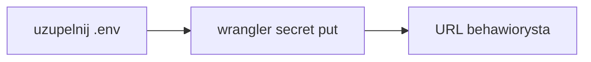

# Dokończenie deployu

Ten plik jest zrzutem sesji Cursora. W nowym oknie czytaj [context/deployment/deploy-plan.md](../../context/deployment/deploy-plan.md). Poniżej jest ten sam stan.

Aktualny Worker to **behawiorysta**: [https://behawiorysta.sigamateusz.workers.dev](https://behawiorysta.sigamateusz.workers.dev), wersja `147ef464-88b4-4c54-9cec-0037a4ed5051` (po sekretach). Upload kodu to `bfa3772f-8556-4d00-b202-cbff7c226fbe`. `npx wrangler` z katalogu repo trafia w niego, bo `name` w [wrangler.jsonc](../../wrangler.jsonc) to `behawiorysta`. Nazwa paczki npm zostaje `10x-astro-starter`.

Wrangler jest zalogowany na **Sigamateusz@gmail.com's Account** (`sigamateusz@gmail.com`, plan Free, Wrangler 4.131.1, `workers (write)`). Cel to Workers, nie Pages. Bez `wrangler pages deploy`, bez `--config` i bez `wrangler deploy --env`. W [astro.config.mjs](../../astro.config.mjs) jest `imageService: "passthrough"` i `session: false`.

Stary Worker `10x-astro-starter` (wersja `9542c9bc-dbf4-46d6-a1ed-5cc41494650e`) już nie istnieje (API, code 10007). To nie jest nazwa `10x-astro-worker`. Nie uruchamialiśmy `wrangler delete`.

`.env` i `.dev.vars` są w `.gitignore` i mają prawdziwe wartości. Na `behawiorysta` są `SUPABASE_URL` i `SUPABASE_KEY`. Baner zniknął. Pomiar po sekretach (`outcome: ok`, brak 1102): `/` 3 ms, `/auth/signin` 46 ms i 22 ms, `/dashboard` 1–2 ms ze statusem 302. Plan Paid nie wchodzi.

## Zostało

Nic z tej listy. Sekrety, baner, usunięcie `10x-astro-starter` i pomiar CPU są zrobione. Przy powtarzalnym 1102 rozważyć Workers Paid (5 USD).

## Świadomie poza tym deployem

- CI z auto-deployem po merge. [infrastructure.md](../../context/foundation/infrastructure.md) ma pipeline poza researchu, a job według `cloudflare-pages` opublikowałby Pages. [.github/workflows/ci.yml](../../.github/workflows/ci.yml) zostaje przy lint, build i smoke.
- Podglądy branchy, `wrangler preview` i Cloudflare Access. Na Wranglerze 4.131.1 podgląd wersji to później `wrangler versions upload`.
- Lokalne `npm run preview` przed kolejnym deployem.
- Docker, multi-region i HA.
- Płatności, realtime, joby w tle i AI. OpenRouter wchodzi, gdy klucz pojawi się w `astro:env/server`.
