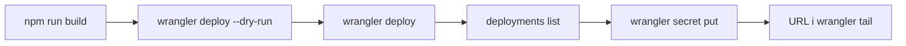

# Dokończenie deployu

Wrangler jest zalogowany na konto **Sigamateusz@gmail.com's Account** (plan Free, Wrangler 4.131.1). Wartości `SUPABASE_URL` i `SUPABASE_KEY` zostają u Ciebie. Nie wklejaj ich na czat i nie commituj.

Cel z [context/foundation/infrastructure.md](context/foundation/infrastructure.md) wygrywa z hintem `deployment_target: cloudflare-pages` w [context/foundation/tech-stack.md](context/foundation/tech-stack.md). Adapter `@astrojs/cloudflare` 14 nie wdraża na Pages. Jedyny cel to Workers: `npm run build` i `npx wrangler deploy` z katalogu głównego, bez `wrangler pages deploy`, bez `--config` i bez `wrangler deploy --env`. Nazwa z [wrangler.jsonc](wrangler.jsonc) zostaje `10x-astro-starter`. Sesja zostaje w ciasteczkach Supabase. Nie włączamy `Astro.session`. Nie podbijamy Wranglera i nie używamy `wrangler preview`.

## Kroki

1. `npm run build`. Osobnego `CLOUDFLARE_ENV` nie ustawiamy: w repo nie ma nazwanego środowiska Cloudflare, a od Astro 6 flaga `wrangler deploy --env` środowiska nie wybiera.
2. `npx wrangler deploy --dry-run` bez `--config`. W logu: nazwa `10x-astro-starter` i `Total Upload` poniżej 64 MiB. Deploy staje, gdy suchy przebieg pokaże binding Cloudflare Images albo inny plik konfiguracji niż główny `wrangler.jsonc`. Images naprawiamy w adapterze przez `imageService: 'passthrough'` albo `'compile'` i powtarzamy suchy przebieg.
3. `npx wrangler deploy`. Jeśli konto nie ma subdomeny `workers.dev`, Wrangler zapyta o nią w terminalu — odpowiadasz Ty.
4. `npx wrangler deployments list` i zapisać id aktywnej wersji kodu. Potem `npx wrangler secret put SUPABASE_URL` i `npx wrangler secret put SUPABASE_KEY`. Wklejasz wartości w prompt Wranglera. Klucz to publishable (`sb_publishable_...`). `secret put` od razu publikuje nową wersję, a `wrangler rollback` sekretów nie cofa. OpenRoutera nie wgrywamy: `has_ai` w tech-stack jest false i klucza nie ma w schemacie `astro:env`.
5. Otworzyć URL `*.workers.dev`. Baner „Supabase nie jest skonfigurowany” ma zniknąć. Wejść na `/auth/signin` i na chroniony `/dashboard` (middleware w [src/middleware.ts](src/middleware.ts)). Równolegle `npx wrangler tail --status error`. Przy powtarzalnym 1102 zatrzymujemy się i podnosimy plan do Workers Paid (5 USD), zanim dojdą klienci. Kalendarza jeszcze nie ma, więc pomiar CPU jest na logowaniu i `/dashboard`.

Po tym zaktualizować checklistę w [context/deployment/deploy-plan.md](context/deployment/deploy-plan.md): odhaczyć build, deploy i sprawdzenie URL, dopisać że sekrety są wgrane, bez zapisywania ich wartości.

## Świadomie poza tym deployem

Z obu dokumentów, ale nie w tym pierwszym wdrożeniu:

- **CI** (`ci_provider: github-actions`, `ci_default_flow: auto-deploy-on-merge` w tech-stack). [infrastructure.md](context/foundation/infrastructure.md) ma CI/CD poza zakresem researchu, a ryzyko H/H mówi, że pipeline według hand-offu opublikuje Pages. Obecny [.github/workflows/ci.yml](.github/workflows/ci.yml) zostaje przy lint, build i smoke.
- **Podglądy branchy.** Na Wranglerze 4.131.1 nie ma `wrangler preview`. Podgląd wersji to później `wrangler versions upload`. Sekrety preview nie dziedziczą się z produkcji. Cloudflare Access na hostach preview wchodzi, zanim pojawią się prawdziwe dane ankiety. Ten URL produkcyjny `workers.dev` jest publiczny; ankiety psa w starterze jeszcze nie ma.
- **Podgląd lokalny przed kolejnym deployem:** `npm run build` i `npm run preview`. Osobne `wrangler dev` i `wrangler pages dev` nie są pętlą tego startera.
- **Docker, multi-region, HA.** Poza zakresem researchu infrastruktury.
- **Płatności, realtime, joby w tle, AI.** Tech-stack ma je wyłączone. OpenRouter wchodzi dopiero, gdy klucz pojawi się w `astro:env/server`.
