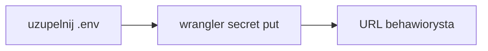

# Dokończenie deployu

Ten plik jest zrzutem sesji Cursora. W nowym oknie czytaj [context/deployment/deploy-plan.md](../../context/deployment/deploy-plan.md). Poniżej jest ten sam stan.

Aktualny Worker to **behawiorysta**: [https://behawiorysta.sigamateusz.workers.dev](https://behawiorysta.sigamateusz.workers.dev), wersja `bfa3772f-8556-4d00-b202-cbff7c226fbe`. `npx wrangler` z katalogu repo trafia w niego, bo `name` w [wrangler.jsonc](../../wrangler.jsonc) to `behawiorysta`. Nazwa paczki npm zostaje `10x-astro-starter`.

Wrangler jest zalogowany na **Sigamateusz@gmail.com's Account** (`sigamateusz@gmail.com`, plan Free, Wrangler 4.131.1, `workers (write)`). Cel to Workers, nie Pages. Bez `wrangler pages deploy`, bez `--config` i bez `wrangler deploy --env`. W [astro.config.mjs](../../astro.config.mjs) jest `imageService: "passthrough"` i `session: false`.

Stary Worker `10x-astro-starter` (wersja `9542c9bc-dbf4-46d6-a1ed-5cc41494650e`) nadal istnieje. `SUPABASE_URL` wgrano tylko na niego. `SUPABASE_KEY` nie. Użytkownik usuwa go sam w panelu. To nie jest nazwa `10x-astro-worker`. Nie uruchamiamy `wrangler delete`.

`.env` i `.dev.vars` są w `.gitignore` i nadal mają `###`. Na `behawiorysta` nie ma sekretów. Pomiar 33 ms CPU i brak 1102 dotyczy starego Workera przed sekretami. Po kluczach na nowym Workerze pomiar trzeba powtórzyć.

## Zostało

1. W `.env` i `.dev.vars` wstaw prawdziwe wartości. Nie commituj ich i nie wklejaj na czat. Klucz to publishable (`sb_publishable_...`), nie secret i nie service role.
2. Z katalogu repo: `npx wrangler secret put SUPABASE_URL`, potem `npx wrangler secret put SUPABASE_KEY`. `secret put` publikuje nową wersję od razu. OpenRoutera nie wgrywamy.
3. Otworzyć nowy URL. Baner „Supabase nie jest skonfigurowany” ma zniknąć. Wejść na `/auth/signin` i `/dashboard`. `npx wrangler tail --status error`. Przy powtarzalnym 1102 zatrzymać się i rozważyć Workers Paid (5 USD).
4. Użytkownik usuwa `10x-astro-starter` w panelu Cloudflare.

## Świadomie poza tym deployem

- CI z auto-deployem po merge. [infrastructure.md](../../context/foundation/infrastructure.md) ma pipeline poza researchu, a job według `cloudflare-pages` opublikowałby Pages. [.github/workflows/ci.yml](../../.github/workflows/ci.yml) zostaje przy lint, build i smoke.
- Podglądy branchy, `wrangler preview` i Cloudflare Access. Na Wranglerze 4.131.1 podgląd wersji to później `wrangler versions upload`.
- Lokalne `npm run preview` przed kolejnym deployem.
- Docker, multi-region i HA.
- Płatności, realtime, joby w tle i AI. OpenRouter wchodzi, gdy klucz pojawi się w `astro:env/server`.
