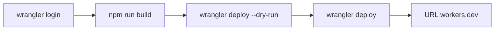

# Pierwsze wdrożenie na Cloudflare Workers

Cel z [infrastructure.md](../foundation/infrastructure.md) (sekcja Getting Started) wygrywa z hintem `deployment_target: cloudflare-pages` w [tech-stack.md](../foundation/tech-stack.md). Adapter `@astrojs/cloudflare` 14 w [astro.config.mjs](../../astro.config.mjs) nie wdraża na Pages. CI zostaje bez joba deployu — pipeline jest poza zakresem tego researchu, a obecny [.github/workflows/ci.yml](../../.github/workflows/ci.yml) tylko buduje i robi smoke.

Nazwa Workera zostaje `10x-astro-starter` z [wrangler.jsonc](../../wrangler.jsonc). Nie podbijamy Wranglera i nie używamy `wrangler preview` ani `wrangler pages deploy`.

## Konto Cloudflare

Do tego wdrożenia wystarczy darmowe konto. Własna domena nie jest potrzebna: Worker dostanie adres `*.workers.dev`.

1. Wejdź na [stronę rejestracji](https://dash.cloudflare.com/sign-up).
2. Podaj e-mail i hasło, potem wybierz **Create Account**.
3. Otwórz wiadomość od Cloudflare i potwierdź adres. Bez tego logowanie Wranglera nie przejdzie.
4. Zostań na planie **Free**. Płatny Workers (5 USD miesięcznie) wchodzi dopiero, gdy po deployu powtarza się błąd limitu CPU 1102.
5. Nie dodawaj domeny w panelu. Subdomenę `workers.dev` Wrangler zaproponuje przy pierwszym `npx wrangler deploy`, jeśli konto jej jeszcze nie ma.

Źródło kroków rejestracji: [Create account](https://developers.cloudflare.com/fundamentals/account/create-account/) (aktualizacja 2026-09-17).

## Kroki

1. Z katalogu repo: `npx wrangler login`. Dokończysz logowanie Cloudflare w przeglądarce na koncie z sekcji powyżej (plan Free). Jeśli konto nie ma jeszcze subdomeny `workers.dev`, Wrangler zapyta o nią przy deployu — to też jest po Twojej stronie.
2. `npm run build`.
3. `npx wrangler deploy --dry-run` bez `--config`. W logu: nazwa `10x-astro-starter` i `Total Upload` poniżej 64 MiB. Deploy idzie dalej tylko, gdy suchy przebieg jest czysty (brak przypadkowego bindowania Cloudflare Images albo innego Workera).
4. `npx wrangler deploy` — pierwszy deploy produkcyjny. Sekretów nie wgrywamy na tym kroku: `wrangler secret put` od razu publikuje nową wersję, a lokalnie nie ma `.env` ani `.dev.vars`.
5. Otworzyć zwrócony URL `*.workers.dev` i sprawdzić, że strona odpowiada. Oczekiwany stan: baner z [src/lib/config-status.ts](../../src/lib/config-status.ts) — „Supabase nie jest skonfigurowany — funkcje uwierzytelniania są wyłączone.” Logowanie na tym URL nie zadziała, dopóki nie wgramy sekretów.

Żadnych zmian w kodzie, o ile build albo dry-run nie pokaże konkretnego błędu konfiguracji.

## Skąd wziąć SUPABASE_URL i SUPABASE_KEY

Na Workera idą wartości z **chmurowego** projektu Supabase. Lokalny Docker (`http://127.0.0.1:54321` z `npx supabase start`) działa tylko na Twoim komputerze i tego adresu Worker nie zobaczy.

### Tworzenie projektu

Na [supabase.com/dashboard](https://supabase.com/dashboard) wybierz **Create a new project** i ustaw formularz tak:

- **Organization** — zostaw swoją organizację na planie Free.
- **GitHub** — zostaw niepodłączony. Wdrożenie idzie przez Wranglera, nie przez integrację Supabase z repozytorium.
- **Project name** — `behawiorysta`.
- **Database password** — zostaw wygenerowane, silne hasło i zapisz je u siebie. Worker go nie używa; służy do bezpośredniego wejścia w Postgresa.
- **Region** — **Europe**.
- **Enable Data API** — włączone. Aplikacja łączy się przez `supabase-js`.
- **Automatically expose new tables** — wyłączone. Nowe tabele nie dostają od razu uprawnień dla klucza, który trafi do Workera.
- **Enable automatic RLS** — włączone. Ankieta i termin jednego klienta mają być niewidoczne dla innych ([prd.md](../foundation/prd.md)), a ten przełącznik włącza Row Level Security na każdej nowej tabeli w schemacie `public`.

Potem **Create new project**. Adres i klucz pojawią się, gdy projekt wstanie.

1. Otwórz gotowy projekt i kliknij **Connect**.
2. Zostaw kafelek **Framework**. Pozostałe (**Server**, **Direct connection string**, **ORM**, **MCP**) dają inne dane: connection string do Postgresa albo instrukcję pod agenta. Tych wartości Worker nie używa.
3. Lista **Framework** może zostać na **Next.js** / **App Router**. To tylko generator snippetu. Pakietów z kroku „Install packages” nie instaluj — `@supabase/supabase-js` i `@supabase/ssr` już są w repo. Plików z kroku „Add files” nie dodawaj. **Install Agent Skills** pomiń. Przełącznik **Shadcn** zostaw wyłączony.
4. Z bloku `.env.local` skopiuj same wartości i zapisz je pod nazwami z tego repo ([README](../../README.md), sekcja „Using a cloud Supabase project”):
   - `NEXT_PUBLIC_SUPABASE_URL` → `SUPABASE_URL` (`https://<project-ref>.supabase.co`, bez `/rest/v1`).
   - `NEXT_PUBLIC_SUPABASE_PUBLISHABLE_KEY` → `SUPABASE_KEY` (zaczyna się od `sb_publishable_`).

Prefiks `NEXT_PUBLIC_` zostaw w panelu. W tej aplikacji oba sekrety są tylko po stronie serwera (`astro:env/server`), więc do `.env`, `.dev.vars` i Workera idą nazwy `SUPABASE_URL` i `SUPABASE_KEY`.

To samo da się odczytać w **Project Settings → API Keys**. W starszym projekcie klucz publishable nazywa się **anon** / **public** i też pasuje do `SUPABASE_KEY`.

Nie wklejaj klucza **secret** (`sb_secret_...`) ani **service_role**.

Gdy podasz obie wartości, wgramy je osobno przez `npx wrangler secret put`. OpenRouter nie wchodzi — nie ma go w schemacie `astro:env`.

Źródło nazw kluczy: [API keys](https://supabase.com/docs/guides/getting-started/api-keys).
