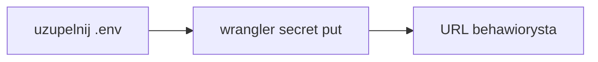

# Pierwsze wdrożenie na Cloudflare Workers

- [x] Zalogować Wranglera (OAuth w przeglądarce)
- [x] Zbudować i sprawdzić `wrangler deploy --dry-run` (nazwa `10x-astro-starter`, `Total Upload` 2038.43 KiB, binding tylko `ASSETS`)
- [x] Wdrożyć Worker przez `npx wrangler deploy`
- [x] Zmienić nazwę Workera z `10x-astro-starter` na `behawiorysta` w [wrangler.jsonc](../../wrangler.jsonc), zbudować i wdrożyć nowego Workera (`https://behawiorysta.sigamateusz.workers.dev`, wersja `bfa3772f-8556-4d00-b202-cbff7c226fbe`)
- [ ] Wgrać `SUPABASE_URL` i `SUPABASE_KEY` przez `npx wrangler secret put` na Workerze `behawiorysta`
- [ ] Otworzyć `https://behawiorysta.sigamateusz.workers.dev` i potwierdzić, że baner o braku Supabase zniknął
- [ ] Ręcznie usunąć starego Workera `10x-astro-starter` w panelu Cloudflare (nie `10x-astro-worker`)

## Stan 2026-09-28

Aktualny Worker to **behawiorysta**: [https://behawiorysta.sigamateusz.workers.dev](https://behawiorysta.sigamateusz.workers.dev), wersja `bfa3772f-8556-4d00-b202-cbff7c226fbe`. Pole `name` w [wrangler.jsonc](../../wrangler.jsonc) to `behawiorysta`. `npx wrangler` z katalogu repo trafia w tego Workera. Nazwa paczki npm zostaje `10x-astro-starter`.

Pierwszy deploy poszedł na `10x-astro-starter` (wersja `9542c9bc-dbf4-46d6-a1ed-5cc41494650e`, adres [https://10x-astro-starter.sigamateusz.workers.dev](https://10x-astro-starter.sigamateusz.workers.dev)). Ten Worker nadal istnieje. `SUPABASE_URL` wgrano tylko na niego. Usuwasz go ręcznie w panelu Cloudflare. Nie uruchamiamy `wrangler delete`.

W [astro.config.mjs](../../astro.config.mjs) jest `imageService: "passthrough"` i `session: false`, bo pierwszy build włączał binding Cloudflare Images i KV `SESSION`. Suchy przebieg pierwszego deployu: `Total Upload` 2038.43 KiB, binding tylko `ASSETS`. Wrangler przekierowuje na `dist/server/wrangler.json`, a ten plik wskazuje z powrotem na główny `wrangler.jsonc`. Osobnego `--config` nie było.

`.env` i `.dev.vars` istnieją i są w `.gitignore`. Oba nadal mają `###` zamiast prawdziwych wartości. Na `behawiorysta` nie ma sekretów, więc baner „Supabase nie jest skonfigurowany” ma tam nadal być. Strona główna nowego adresu zwraca 200. Pomiar CPU (33 ms na `/auth/signin`, `outcome: ok`, brak 1102) dotyczy starego Workera, zanim doszły sekrety. Po wgraniu kluczy na `behawiorysta` pomiar trzeba powtórzyć. Plan Paid wchodzi dopiero, gdy 1102 zacznie się powtarzać.

## Świadomie poza tym deployem

- CI z auto-deployem po merge. [infrastructure.md](../foundation/infrastructure.md) ma pipeline poza researchu, a job według `cloudflare-pages` opublikowałby Pages. [.github/workflows/ci.yml](../../.github/workflows/ci.yml) zostaje przy lint, build i smoke.
- Podglądy branchy, `wrangler preview` i Cloudflare Access. Na Wranglerze 4.131.1 podgląd wersji to później `wrangler versions upload`.
- Lokalne `npm run preview` przed kolejnym deployem. Osobne `wrangler dev` i `wrangler pages dev` nie są pętlą tego startera.
- Docker, multi-region i HA.
- Płatności, realtime, joby w tle i AI. OpenRouter wchodzi, gdy klucz pojawi się w `astro:env/server`.

Cel z [infrastructure.md](../foundation/infrastructure.md) (sekcja Getting Started) wygrywa z hintem `deployment_target: cloudflare-pages` w [tech-stack.md](../foundation/tech-stack.md). Adapter `@astrojs/cloudflare` 14 w [astro.config.mjs](../../astro.config.mjs) nie wdraża na Pages. CI zostaje bez joba deployu — pipeline jest poza zakresem tego researchu, a obecny [.github/workflows/ci.yml](../../.github/workflows/ci.yml) tylko buduje i robi smoke.

Nie podbijamy Wranglera i nie używamy `wrangler preview` ani `wrangler pages deploy`.

## Konto Cloudflare

Konto jest założone i Wrangler jest na nim zalogowany. Sprawdzone 2026-09-28 poleceniem `npx wrangler whoami` (Wrangler 4.131.1):

- konto: **[Sigamateusz@gmail.com](mailto:Sigamateusz@gmail.com)'s Account**
- e-mail sesji OAuth: `sigamateusz@gmail.com`
- token ma `workers (write)`, więc `npx wrangler deploy` może iść z tego konta

Własna domena nie jest potrzebna. Subdomena `workers.dev` już jest: `sigamateusz`. Zostajemy na planie **Free**. Płatny Workers (5 USD miesięcznie) wchodzi dopiero, gdy po sekretach powtarza się błąd limitu CPU 1102.

## Zostało

1. W `.env` i `.dev.vars` zamień `###` na prawdziwe `SUPABASE_URL` i `SUPABASE_KEY`. Nie commituj tych plików i nie wklejaj wartości na czat.
2. Z katalogu repo, na Workerze `behawiorysta`: `npx wrangler secret put SUPABASE_URL`, potem `npx wrangler secret put SUPABASE_KEY`. Klucz to publishable (`sb_publishable_...`). `secret put` publikuje nową wersję od razu, a `wrangler rollback` sekretów nie cofa. OpenRoutera nie wgrywamy.
3. Otworzyć [https://behawiorysta.sigamateusz.workers.dev](https://behawiorysta.sigamateusz.workers.dev). Baner „Supabase nie jest skonfigurowany” ma zniknąć. Wejść na `/auth/signin` i `/dashboard`. Równolegle `npx wrangler tail --status error`. Przy powtarzalnym 1102 zatrzymać się przed klientami.
4. Starego Workera `10x-astro-starter` usuwasz sam w panelu Cloudflare. To nie jest `10x-astro-worker`.

## Skąd wziąć SUPABASE_URL i SUPABASE_KEY

Na Workera idą wartości z **chmurowego** projektu Supabase. Lokalny Docker (`http://127.0.0.1:54321` z `npx supabase start`) działa tylko na Twoim komputerze i tego adresu Worker nie zobaczy.

### Tworzenie projektu

Na [supabase.com/dashboard](https://supabase.com/dashboard) wybierz **Create a new project** i ustaw formularz tak:

- **Organization** — zostaw swoją organizację na planie Free.
- **GitHub** — zostaw niepodłączony. Wdrożenie idzie przez Wranglera, nie przez integrację Supabase z repozytorium.
- **Project name** — `behawiorysta`.
- **Database password** — zostaw wygenerowane, silne hasło i zapisz je u siebie. Worker go nie używa; służy do bezpośredniego wejścia w Postgresa.
- **Region** — **Europe**.
- **Enable Data API** — włączone. Aplikacja łączy się przez `supabase-js`.
- **Automatically expose new tables** — wyłączone. Nowe tabele nie dostają od razu uprawnień dla klucza, który trafi do Workera.
- **Enable automatic RLS** — włączone. Ankieta i termin jednego klienta mają być niewidoczne dla innych ([prd.md](../foundation/prd.md)), a ten przełącznik włącza Row Level Security na każdej nowej tabeli w schemacie `public`.

Potem **Create new project**. Adres i klucz pojawią się, gdy projekt wstanie.

1. Otwórz gotowy projekt i kliknij **Connect**.
2. Zostaw kafelek **Framework**. Pozostałe (**Server**, **Direct connection string**, **ORM**, **MCP**) dają inne dane: connection string do Postgresa albo instrukcję pod agenta. Tych wartości Worker nie używa.
3. Lista **Framework** może zostać na **Next.js** / **App Router**. To tylko generator snippetu. Pakietów z kroku „Install packages” nie instaluj — `@supabase/supabase-js` i `@supabase/ssr` już są w repo. Plików z kroku „Add files” nie dodawaj. **Install Agent Skills** pomiń. Przełącznik **Shadcn** zostaw wyłączony.
4. Z bloku `.env.local` skopiuj same wartości i zapisz je pod nazwami z tego repo ([README](../../README.md), sekcja „Using a cloud Supabase project”):
  - `NEXT_PUBLIC_SUPABASE_URL` → `SUPABASE_URL` (`https://<project-ref>.supabase.co`, bez `/rest/v1`).
  - `NEXT_PUBLIC_SUPABASE_PUBLISHABLE_KEY` → `SUPABASE_KEY` (zaczyna się od `sb_publishable_`).

Prefiks `NEXT_PUBLIC_` zostaw w panelu. W tej aplikacji oba sekrety są tylko po stronie serwera (`astro:env/server`), więc do `.env`, `.dev.vars` i Workera idą nazwy `SUPABASE_URL` i `SUPABASE_KEY`.

To samo da się odczytać w **Project Settings → API Keys**. W starszym projekcie klucz publishable nazywa się **anon** / **public** i też pasuje do `SUPABASE_KEY`.

Nie wklejaj klucza **secret** (`sb_secret_...`) ani **service_role**.

Wartości trafiają do `.env`, `.dev.vars` i potem na Workera `behawiorysta` przez `npx wrangler secret put`. OpenRouter nie wchodzi — nie ma go w schemacie `astro:env`.

Źródło nazw kluczy: [API keys](https://supabase.com/docs/guides/getting-started/api-keys).