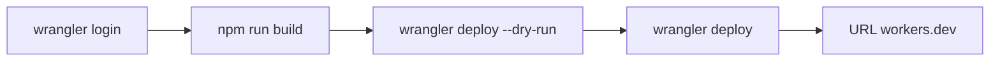

# Pierwsze wdrożenie na Cloudflare Workers

Cel z [infrastructure.md](../foundation/infrastructure.md) (sekcja Getting Started) wygrywa z hintem `deployment_target: cloudflare-pages` w [tech-stack.md](../foundation/tech-stack.md). Adapter `@astrojs/cloudflare` 14 w [astro.config.mjs](../../astro.config.mjs) nie wdraża na Pages. CI zostaje bez joba deployu — pipeline jest poza zakresem tego researchu, a obecny [.github/workflows/ci.yml](../../.github/workflows/ci.yml) tylko buduje i robi smoke.

Nazwa Workera zostaje `10x-astro-starter` z [wrangler.jsonc](../../wrangler.jsonc). Nie podbijamy Wranglera i nie używamy `wrangler preview` ani `wrangler pages deploy`.

## Kroki

1. Z katalogu repo: `npx wrangler login`. Dokończysz logowanie Cloudflare w przeglądarce (konto może zostać na planie Free). Jeśli konto nie ma jeszcze subdomeny `workers.dev`, Wrangler zapyta o nią przy deployu — to też jest po Twojej stronie.
2. `npm run build`.
3. `npx wrangler deploy --dry-run` bez `--config`. W logu: nazwa `10x-astro-starter` i `Total Upload` poniżej 64 MiB. Deploy idzie dalej tylko, gdy suchy przebieg jest czysty (brak przypadkowego bindowania Cloudflare Images albo innego Workera).
4. `npx wrangler deploy` — pierwszy deploy produkcyjny. Sekretów nie wgrywamy na tym kroku: `wrangler secret put` od razu publikuje nową wersję, a lokalnie nie ma `.env` ani `.dev.vars`.
5. Otworzyć zwrócony URL `*.workers.dev` i sprawdzić, że strona odpowiada. Oczekiwany stan: baner z [src/lib/config-status.ts](../../src/lib/config-status.ts) — „Supabase nie jest skonfigurowany — funkcje uwierzytelniania są wyłączone.” Logowanie na tym URL nie zadziała, dopóki nie wgramy sekretów.

## Po Twojej stronie, później

Gdy podasz chmurowy `SUPABASE_URL` i `SUPABASE_KEY` (klucz anon, nie service role), wgramy je osobno przez `npx wrangler secret put`. Lokalny Docker tego Workera nie zobaczy. OpenRouter nie wchodzi — nie ma go w schemacie `astro:env`.

Żadnych zmian w kodzie, o ile build albo dry-run nie pokaże konkretnego błędu konfiguracji.
